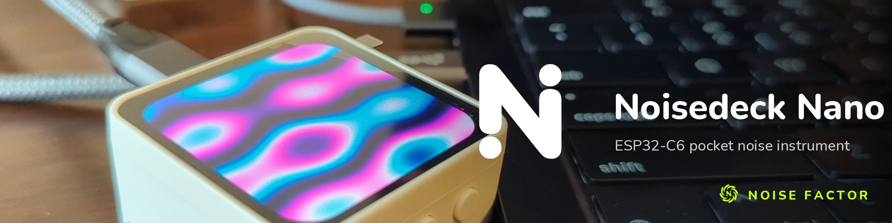

# Noisedeck Nano



A pocket generative-noise instrument for the Waveshare
[ESP32-C6-Touch-AMOLED-2.16](https://www.waveshare.com/esp32-c6-touch-amoled-2.16.htm)
(480x480 AMOLED, CO5300 over QSPI, CST9220 touch, QMI8658 IMU, AXP2101 PMIC). It runs
procedural noise visuals through looped palettes at up to 40 fps, has an on-screen menu,
shuffles on touch, button or a shake, and speaks a tiny USB serial protocol so it can
double as a status light that answers `up` like a web service health check.

By [Noise Factor](https://noisefactor.io), makers of [Noisedeck](https://noisedeck.app).

## Using it

The screen always tells you what to do: "TAP: MENU" sits along the bottom until you
have opened the menu once, every change flashes the new effect / palette name, and
closing the menu shows the gesture cheat-sheet for a few seconds.

| Input | Action |
|---|---|
| tap | open the menu |
| in the menu: tap a row's left / right half | step EFFECT, PALETTE or BRIGHT |
| in the menu: AUTO, SHUFFLE, SCREEN OFF, CLOSE | toggle auto-shuffle, shuffle, sleep, close (tapping outside the panel also closes; it auto-closes after 15 s) |
| swipe left / right | next / previous effect (distance-based, any speed) |
| swipe up / down | next / previous palette |
| hold still for 0.3 s, then drag | steer the effect's focal point (a "STEER" cue appears) |
| BOOT button, or shake the board | shuffle effect and palette |
| while asleep: any touch, the button, or a shake | wake |

Effects: `plasma`, `zone` (two drifting zone plates interfering), `flow` (two-octave
value noise morphing between keyframes), `static`. Every change passes through a
short burst of TV static. Palettes: `deck`, `magma`, `phosphor`, `vapor`, `ice`,
`mono`, `acid`, `sunset`, plus `ok` / `warn` / `crit` mood palettes.

### Serial (USB, 115200)

```
bin/nano.py up                 {"status":"ok","service":"noisedeck-nano","version":"0.2",...}
bin/nano.py fx zone            also: plasma flow static, a number, next, prev, rand
bin/nano.py pal magma          also: next, prev, rand
bin/nano.py mood crit          ok | warn | crit | off   (crit = red, 2x speed, flicker)
bin/nano.py auto 30            on | off | seconds
bin/nano.py bright 120         0..255
bin/nano.py speed 150          10..400 percent
bin/nano.py text HELLO         flash a message for 4 s
bin/nano.py shuffle
bin/nano.py menu               toggle the on-screen menu
bin/nano.py sleep              screen off (bin/nano.py wake to wake)
bin/nano.py listen 60          tail the log: gestures, fps every 10 s, shuffles
bin/nano.py perf               frame-time report since last query (worst frame, per-section)
bin/nano.py fleet URL...       poll health endpoints every 60 s and set the mood
```

`fleet` keeps the port open and maps "all ok" to `ok`, one failing endpoint to
`warn`, two or more to `crit`. It expects each URL to answer HTTP 200, ideally with
`{"status":"ok"}`; the built-in default list is Noise Factor's own services, so pass
your own.

## Building and flashing

```
bin/flash.sh          # build + flash to the first /dev/cu.usbmodem*
bin/flash.sh build    # build only
bin/test.sh           # host-side engine test (renders every effect, ASCII previews)
```

Needs [`arduino-cli`](https://arduino.github.io/arduino-cli/) and python3; the scripts
are written for macOS (`/dev/cu.usbmodem*`, Homebrew paths) and should need only the
port glob and the `boot_app0.bin` path changed for Linux. `bin/flash.sh` installs the
esp32 core 3.3.11 and XPowersLib 0.3.3 into a project-local sketchbook
(`.arduino-user/`, ignored) and an esptool venv (`.venv/`, ignored). FQBN: `esp32c6`,
USB CDC on boot, 16 MB flash, `app3M_fat9M_16MB` partitions.

Two gotchas the script already handles, written down so nobody rediscovers them:

1. **Write the bootloader header as DIO/40 MHz.** The C6 ROM loads the second-stage
   bootloader in DIO. Flashing with `esptool --flash-mode qio` rewrites the header to
   QIO and the board boot-loops at `ets_loader.c 67`. Arduino's "QIO" menu option
   uses a QIO-capable bootloader binary but still writes the header as DIO.
2. **Large writes over USB-JTAG stall on macOS** about one run in three ("No more data
   to read from the serial port", at a random offset). esptool hash-verifies every
   write, so the script just retries until a run verifies.

Opening the serial port does not reset the board, but toggling DTR/RTS does (the
USB-JTAG maps them to reset), which is why `bin/nano.py` never touches them.

### Restoring the factory firmware

Back up the flash before the first write (`esptool read-flash 0 0x1000000 backup.bin`,
about a minute). Waveshare also publish the factory image as
`03_Firmware/01_Fac-v1.0.0.bin` in
https://github.com/waveshareteam/ESP32-C6-Touch-AMOLED-2.16. Either restores with:

```
.venv/bin/python -m esptool --chip esp32c6 --port /dev/cu.usbmodem101 write-flash 0x0 <image.bin>
```

(retry on a USB stall, exactly as above).

## How it works

`noisedeck_nano/src/fx/` is plain C99 with no floats in any per-pixel path (the C6 has
no FPU): sine, smoothstep and square-root lookup tables, 24.8 fixed-point phases,
32x32 value-noise lattices. The same files compile on a host for `host/test.c`, which
renders every effect under ASan/UBSan and prints ASCII previews.

The 480x480x16-bit frame (460 KB) does not fit in the C6's RAM, so frames are rendered
as ten 48-row bands into two DMA buffers: the CPU fills band N+1 while band N is on
the QSPI bus. Plasma and flow are computed at 240x240 and pixel-doubled with 32-bit
stores; zone plates and static run at full resolution. Measured on the device:
plasma and static 40.6 fps (the 40 MHz QSPI transfer ceiling), flow 27.5 fps, zone 24 fps,
with about 316 KB of heap free and flat.

`src/ui/` draws the menu and hint strip straight into the band buffers (the effect keeps
running underneath through a palette dimmed to 22%), and is host-tested the same way,
including the touch hit regions.

`src/bsp/` is the board support: the pin map, an I2C wrapper, the AXP2101 rail plan
(ALDO3 powers the panel and is power-cycled in place of a reset line), the CST9220
touch read, the QMI8658 accelerometer, and Espressif's SH8601-family `esp_lcd` driver
for the CO5300. `src/display.cpp` is the esp_lcd bring-up; pixels go out as big-endian
RGB565. See [THIRD_PARTY.md](THIRD_PARTY.md) for provenance.

## License and trademark

Code is MIT-licensed, see [LICENSE](LICENSE). "Noisedeck" and "Noise Factor" naming is
governed by [TRADEMARK.md](TRADEMARK.md); read it before using either name for a
derivative product. Contributions are welcome under the
[code of conduct](CODE_OF_CONDUCT.md).
